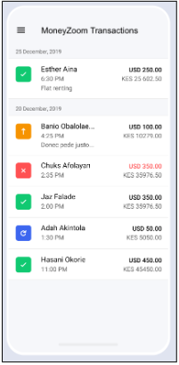
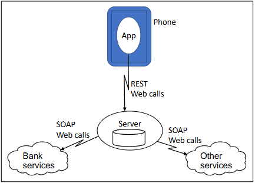

:::::::::::::::::::::::::::::::::::::: questions 

- How do you play the agile security game?
- What are the outcomes of the game?

::::::::::::::::::::::::::::::::::::::::::::::::

::::::::::::::::::::::::::::::::::::: objectives

- For each Agile sprint, discuss and agree amongst yourselves which stories to implemnt.
- Record your chosen sotries for that sprint (write down the code letters).

::::::::::::::::::::::::::::::::::::::::::::::::

::::::::::::::::::::::::::::::::::::: instructor
### Instructor Notes - Prep

### Preparation in Advance - Face-to-Face

1. Calculate how many players you’ll have, and so how many teams of 3-6 players you’ll need.
2. Print the two side GamePlayerInstructionsPrinted.pdf sheet, one per player, preferably 2-sided.
3. Print from CardsFourToPage.pdf a set of task cards for each team, on A4 paper, one sided and ideally on light card (black and white is fine, colour better). Then cut them out, preferably with a guillotine (or see below).
4. Sort out cards in advance into individual mini-packs of a set of each (A, B, C, or D), according to the letters in the top right corner. Each pack has an additional ‘cover’ card. A packs have 8 cards; B, C, and D have 4 cards.
5. Optionally, you might like to get large flipchart sheets of paper for the teams to use as Kanban boards on the table, or arrange for a whiteboard for each team with blu-
tack to stick the cards there.

### Setup on the Day

6. Arrange the room with separate tables with 2-6 chairs around each table. Make there’s a piece of blank paper and pen for each team.
7. Set up a projector/display visible to all the players, showing the *DeveloperSecurityEssentials.pptx* presentation. Note that if no projector/display screen is available, you could use the option of reading out the content of the slides instead.
8. Sort out cards in advance into individual mini-packs of a set of each (A, B, C, or D), with cover. A packs have 8 cards; B, C, and D have 4 cards.

## Running the Workshop
The workshop has an introduction, up to four rounds, or ‘sprints’, and a wrap-up session.
Timings are approximate. Adjust them according to how the teams are getting on in each step.

TABLE 1: WHEN TO GIVE OUT CARDS

Tell the participants that they are taking the role of agile product managers for the MoneyZoom product; their role is to decide on the stories for the development team to tackle each sprint.
In the first couple of sprints each team will be able to complete 11 story points, using the Kanban board on their shared board.
Stories chosen from previous sprints will remain part of the product and available to mitigate attacks. Stories not chosen in a given sprint will remain on the backlog as candidates to be chosen in later sprints.
Optionally you might use the first PowerPoint slide.

Face-to-face: Organise the players into teams of 2-6 people, each team sitting at chairs around a table, as shown in Figure 1. 
Give each player a set of Player Instructions.

The workshop then proceeds in ‘sprints’.

::::::::::::::::::::::::::::::::::::::::::::::::

## Player Instructions

We’ve got a problem. The MoneyZoom money management app we released last week has gone viral. 
People are downloading it by the tens of thousands; they’re all using it massively, and it’s received thousands of tweets and masses of mentions on every other social network.
Even the Daily Mail newspaper has had an article on it.

Trouble is, we’re a start-up and it was only supposed to be a
limited pilot.
We’ve put in only rudimentary security because we believed it under the radar for any of the likely attackers.
But now we’ve got everyone from celebrities to my grandmother using it to pay for everything from gas bills to online games. AND IT’S NOT SAFE!

{alt='UI of Moneyzoom' style="float:right; width:300px;height:auto"}

As the figure to the right shows, the functionality is all there and works well enough – fantastically done, team!
Your mission now, should you choose to accept it, is to prioritise and implement the security enhancements to the system in the best way to minimise the threat to us and our users.
Are you up for it? 
Let’s start now.

It’s an agile project, of course, with two-week sprints.
So each round in this game is a two week sprint.
And for each sprint you have story cards with options you can take, and the estimated cost for each in estimation units.
Some are security enhancements; some are test actions (the estimates include basic fixes that result from the testing); some are research activities which may lead to further tasks.

You have an initial budget for each sprint of **11 units**, building up as you build up the team to **12 units for sprints 3 onwards**; you can’t go over your budget and of course unused units don’t carry over the next sprint.
You decide what you’ll do and the two weeks go by in a trice. 
And at the end of the sprint you’ll do a release of both app and server, and maybe get some new options opened up by the research you’ve done or the actions you’ve taken in the past.

And in the next sprint, and following sprint you do the same again. 
But remember – we also have a released product out there and maybe attackers will be DOING NASTY THINGS.
Whether they’ll be successful or not depends on what decisions you made.

{alt='Model of Moneyzoom'}

The game has some simplifications in timing.
It ignores the time lag for getting apps from release to deployment.
It assumes a stunningly agile team who can all move easily from server to app and from coding to reviewing to pen testing.
And, remarkably, each task turns out to take exactly the effort estimated!
So, you’ll get feedback on what NASTY THINGS have happened at the end of the sprint when you make each release.

For each sprint, discuss and agree amongst yourselves which stories to implement; record your chosen stories for that sprint (write down the code letters).
The purpose and the learning of the game is in the discussion. 
Once the decisions are made, the game leader will feed back what has happened: any exploits seen during that sprint (of the code in the previous sprint’s release), and any new stories suggested by the learning from that sprint.

## A Little Bit about Moneyzoom

MoneyZoom is an off-banking app. Here’s what I as a user can do with MoneyZoom:

- See the transactions I’ve done
- Change my name, address and contact details
- Transfer money to other MoneyZoom users
- Pay bills to well-known organisations (Utilities, tax)
- Pay money to other people’s bank accounts
- Put in money in from my payment card.

The MoneyZoom app communicates with an ‘App Server’, which itself is connected to banking back ends, the EMV networks, and a variety of other services, as shown in Figure 2.

<!-- SPRINTS -->

## Sprints

::::::::::::::::::::::::::::::::::::: instructor
### Instructor Notes - Sprints

### Sprints 1-4 (10-25 minutes each)

1. Copy/place new ‘cards’ as shown in Table 1 to each team’s table in the backlog area if possible (there may be more one set of cards to hand out). Note that you don’t take cards away at any point – cards that haven’t been used remain in the ‘backlog’ for future sprints.
2. **Online:** Send the participants into their breakout rooms
3. Have them then select their tasks to carry out by moving the selected cards to the ‘this sprint’ column on their table or otherwise choosing a set of cards.
4. Allow the players time to discuss and decide. Typical timings are as in Table 2, but depend on the teams. Remember the point of the game is to learn from discussion, not to win; if there’s a good deal of discussion taking place and time permits, allow
the teams longer.
5. **Online:** Then bring them back to a plenary session or
6. **Face-to-face:** Gain their attention.
7. Show the attacks for the corresponding sprint using the presentation (or read them out from the Attacks and Mitigations document). The teams see which attacks succeeded on them.

Teams sometimes ‘negotiate’ on whether their chosen mitigations would actually have prevented the events. 
We suggest you enter into the spirit of it, and accept anything reasonable.

::::::::::::::::::::::::::::::::::::::::::::::::

::::::::::::::::::::::::::::::::::::: challenge

## Sprint 1 

Using 11 points, pick the stories that will be completed this sprint.

::::::::::::::::::::::::::::::::::::: hint

### Something bad happens...

Scanning Kiddie – gets to server by accident – maliciously deletes all data.

DoSing Kiddie – gets to server by accident – uses for ddos attacks on other servers

::::::::::::::::::::::::::::::::::::::::::::::::
::::::::::::::::::::::::::::::::::::: solution

### Mitigations

Scanning Kiddie – gets to server by accident – maliciously deletes all data.

- Backup Server (BS)  **OR**  Server patches up to date (PT)

DoSing Kiddie – gets to server by accident – uses for ddos attacks on other servers

- Server patches up to date (PT)

::::::::::::::::::::::::::::::::::::::::::::::::

::::::::::::::::::::::::::::::::::::::::::::::::

::::::::::::::::::::::::::::::::::::: challenge

## Sprint 2 

Using 11 points, pick the stories that will be completed this sprint.

::::::::::::::::::::::::::::::::::::: hint

### Something bad happens...

Hacking Kiddie – gets to server by accident – downloads and publishes what he finds.

Phishing Kiddie – sends spam email, gets subscribers to download rogue version or enter credentials in spoof website.

Detective or journalist hacker – wants account information for specific users – server hack – publishes information or causes customer complaints.

::::::::::::::::::::::::::::::::::::::::::::::::
::::::::::::::::::::::::::::::::::::: solution

### Mitigations

Hacking Kiddie – gets to server by accident – downloads and publishes what he finds.

- Server patches up to date (PT)

Phishing Kiddie – sends spam email, gets subscribers to download rogue version or enter credentials in spoof website.

- Contingency Plan (CP)  **OR**  Two Factor Authentication (2F*)

Detective or journalist hacker – wants account information for specific users – server hack – publishes information or causes customer complaints.

- Server Pen testing (PT) AND Encrypt and Hide data on server (EH*)

\* requires penetration testing

::::::::::::::::::::::::::::::::::::::::::::::::

::::::::::::::::::::::::::::::::::::::::::::::::

::::::::::::::::::::::::::::::::::::: challenge

## Sprint 3 

Using **12** points, pick the stories that will be completed this sprint.

::::::::::::::::::::::::::::::::::::: hint

### Something bad happens...

MITM kiddie – Spoofs WiFi access point in airport – Gains credentials – randomly hacks accounts.

Aggrieved hacker – gains access to server – downloads or modifies server data – publicizes.

*(FATAL) MITM Mafia – spoofs WiFi access point in airport – uses dodgy root certificates to validate all banking services - gains credentials – steals small amount from each.*

::::::::::::::::::::::::::::::::::::::::::::::::
::::::::::::::::::::::::::::::::::::: solution

### Mitigations

MITM kiddie – Spoofs WiFi access point in airport – Gains credentials – randomly hacks accounts.

- HTTPS in Protocol (HP)  **OR**  Two Factor Authentication (2F)

Aggrieved hacker – gains access to server – downloads or modifies server data – publicizes.

- Server Pen Testing, **AND** Encrypt and Hide data on Server (PT, EH*).

*(FATAL) MITM Mafia – spoofs WiFi access point in airport – uses dodgy root certificates to validate all banking services - gains credentials – steals small amount from each.*

- Forced Upgrades and SSL Pinning (FU, SS) **OR** Two Factor Authentication (2F)

\* requires penetration testing

::::::::::::::::::::::::::::::::::::::::::::::::

::::::::::::::::::::::::::::::::::::::::::::::::

::::::::::::::::::::::::::::::::::::: challenge

## Sprint 4

Using **12** points, pick the stories that will be completed this sprint.

::::::::::::::::::::::::::::::::::::: hint

### Something bad happens...

*Mafia Team – Gain access to office, get passwords from server logs, small theft from tens of thousands of accounts.*

*Mafia Advanced Programming Team – gain access to server though zero day exploit, installed hacked version, transfer money out of accounts.*

*Mafia APT - Malware on device via email – sends back credentials found in logs to command and control server – used to clean out all compromised accounts.*

::::::::::::::::::::::::::::::::::::::::::::::::
::::::::::::::::::::::::::::::::::::: solution

### Mitigations

*Mafia Team – Gain access to office, get passwords from server logs, small theft from tens of thousands of accounts.*

-Prevent Access to Office (PA) **OR** Filtered Logging for Server (FL) **OR** Two Factor Authentication (2F)

*Mafia Advanced Programming Team – gain access to server though zero day exploit, installed hacked version, transfer money out of accounts.*

- Network Monitoring for Server (NM)

*Mafia APT - Malware on device via email – sends back credentials found in logs to command and control server – used to clean out all compromised accounts.*

- Forced Upgrades **AND** Sanitize App Logging (FU, SA), **else**: Two Factor Authentication (2F)

\* requires penetration testing

*Text* Fatal
::::::::::::::::::::::::::::::::::::::::::::::::

::::::::::::::::::::::::::::::::::::::::::::::::

::::::::::::::::::::::::::::::::::::: instructor

### Instructor Notes - Wrap Up

### Wrap-Up (10 min)

Ask the teams to discuss what they feel they learned from the game.
Then either get a representative to report back for each, or (larger group) use an ‘open ended’ question on Menti.com to gather and share feedback (this can work even face-to-face).
You may like to explain some less obvious learning points (with the appropriate slide):
- The password tasks (EP – Complex Passwords, and CC – Credential Changes) conflict
with recent UK National Cyber Security Centre guidance, and have no benefit.
- Detecting Jailbroken devices (DJ) doesn’t really help with app security – few apps do it nowadays. Similarly Review of Server Code (RS) is rarely used.

### Some Notes about the Game

In a real world situation obviously one wouldn’t get feedback and lists of attacks before the start of the next agile sprint. 
If this worries you or the players, say that the ‘security enhancement’ sprints we’re doing here would actually be interspersed with a number of functionality sprints, allowing plenty of time for feedback before the next sprint.
Observe in the attack descriptions that in some cases the mitigations are alternatives: the first attack could be mitigated by either BS or PT. 
But in other cases the teams must have completed all of a collection of tasks to mitigate the attack.

::::::::::::::::::::::::::::::::::::::::::::::::

::::::::::::::::::::::::::::::::::::: callout 

## Some Notes about the Game

In a real world situation obviously one wouldn’t get feedback and lists of attacks before the
start of the next agile sprint.
These king of ‘security enhancement’ sprints we’re doing here would actually be interspersed with a number of functionality sprints, allowing plenty of time for feedback before the next sprint.

Also, observe in the attack descriptions that in some cases the mitigations are alternatives: the
first attack could be mitigated by either BS or PT.
But in other cases the teams must have completed all of a collection of tasks to mitigate the attack.

::::::::::::::::::::::::::::::::::::::::::::::::

::::::::::::::::::::::::::::::::::::: keypoints 

- Choosing how to use your limited resources to increase security is difficult.
- Assess possible threats before they happen!

::::::::::::::::::::::::::::::::::::::::::::::::

